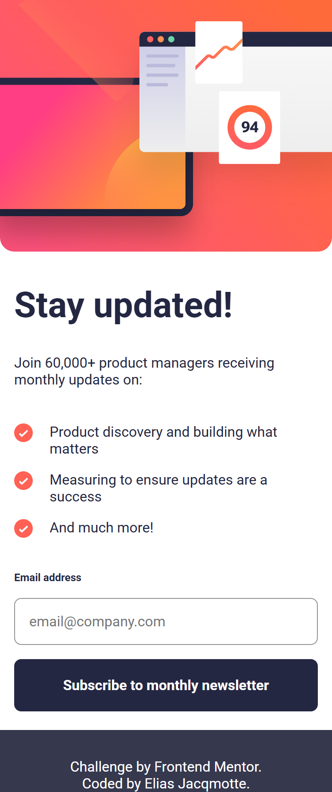
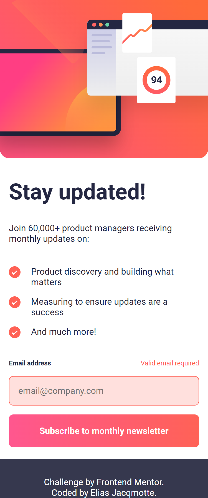
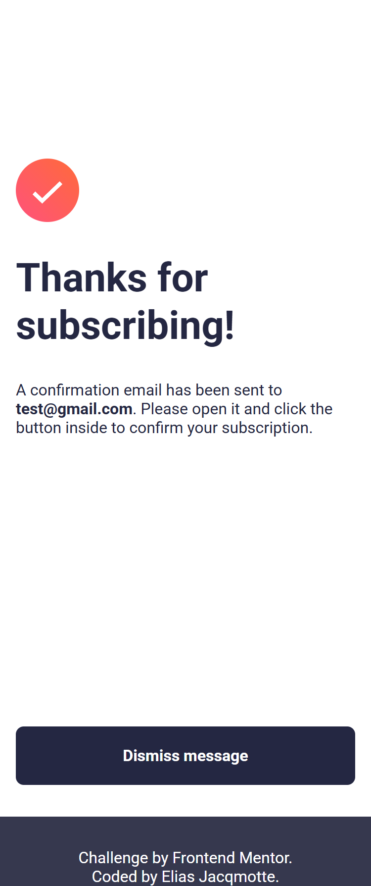
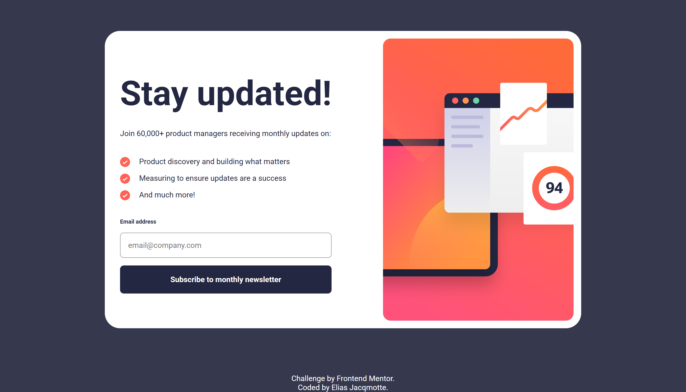
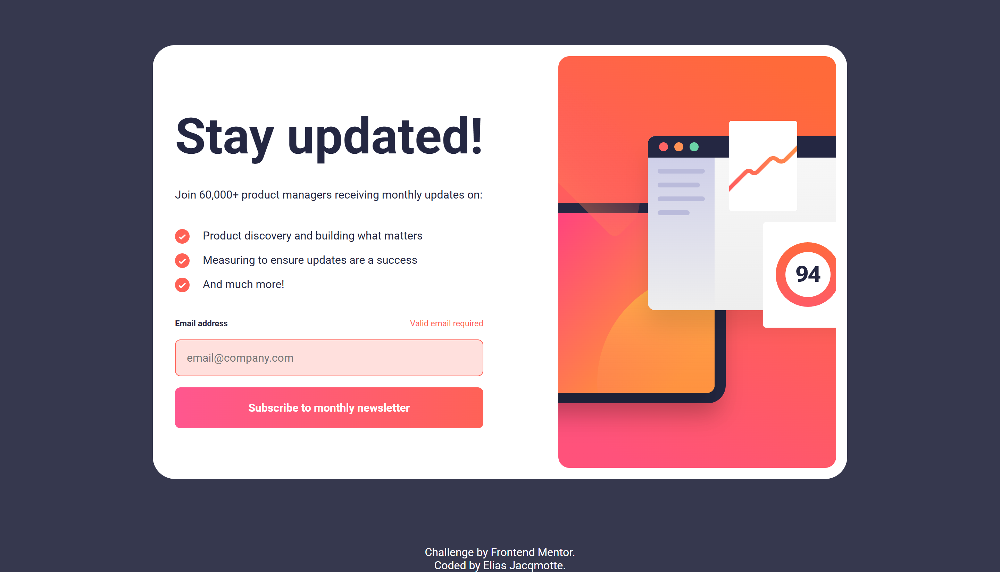
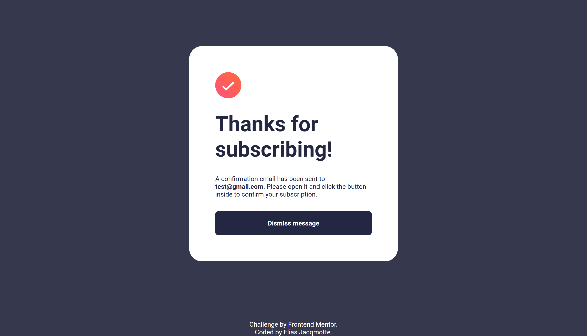

# Frontend Mentor - Newsletter sign-up form with success message solution

This is a solution to the [Newsletter sign-up form with success message challenge on Frontend Mentor](https://www.frontendmentor.io/challenges/newsletter-signup-form-with-success-message-3FC1AZbNrv). Frontend Mentor challenges help you improve your coding skills by building realistic projects. 

## Table of contents

- [Overview](#overview)
  - [The challenge](#the-challenge)
  - [Screenshot](#screenshot)
  - [Links](#links)
- [My process](#my-process)
  - [Built with](#built-with)
  - [What I learned](#what-i-learned)
- [Author](#author)

## Overview

### The challenge

Users should be able to:

- Add their email and submit the form
- See a success message with their email after successfully submitting the form
- See form validation messages if:
  - The field is left empty
  - The email address is not formatted correctly
- View the optimal layout for the interface depending on their device's screen size
- See hover and focus states for all interactive elements on the page

### Screenshot

#### Mobile - Design


#### Mobile - Error


#### Mobile - Success


#### Desktop - Design


#### Desktop - Error


#### Desktop - Success



### Links

- Live Site URL: [Github pages](https://your-live-site-url.com)

## My process

### Built with

- Semantic HTML5 markup
- CSS custom properties
- Flexbox
- CSS Grid
- Mobile-first workflow

### What I learned

I have learned how to make the background-image clamp to the text that it is placed on.  
Using the "background-clip" property, this solution was possible.  

I have learned how to implement an image as a bullet point.  
I have used positioning for the image:
```CSS
main section li {
    padding-block: 0.5rem;
    padding-left: 2.5rem;
    background-image: url(assets/images/icon-list.svg);
    background-repeat: no-repeat;
    background-position: 0 0.5rem;
}
```
Using the background-position I have set the image centered with the text. This position uses the same block padding as in the list element.

## Author

- Frontend Mentor - [@elias-jacqmotte](https://www.frontendmentor.io/profile/elias-jacqmotte)